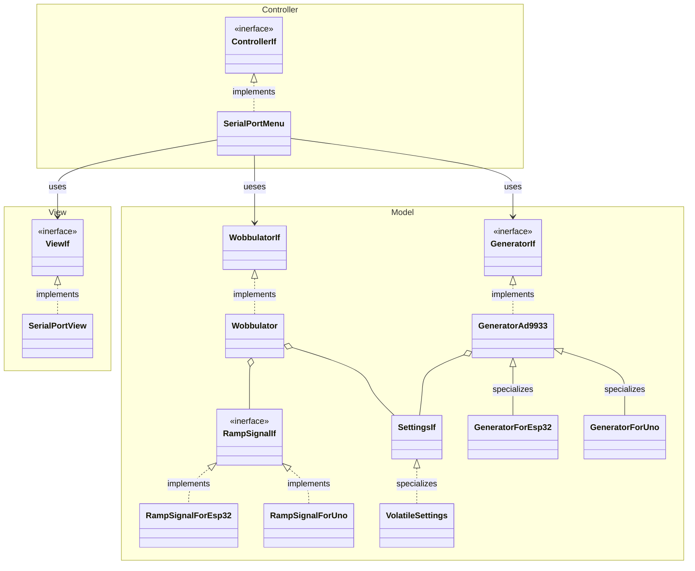

# signal_generator_ad9833

Ver 0.3.2

# Introduction

This is a signal generator for Arduino UNO / ESP32 with the use of AD9833 chips.
it uses AD9833 chips. It depends on robtillaart/AD9833 library to talk to the AD9833.
But the idea is the core of functionality can be switched to a different chip without a lot of changes.
At least as long as suitable libraries to talk with the chip are available.

# Current features

- Double or single channel sine, square and ramp signal up to 12Mhz.
- Wobbulator up to 12Mhz (ESP32 for now).
- Control over serial port (same as power).

# Required hardware

- Atmega 328p with Arduino UNO (or clone) + 2 x AD9833 (for two channel configuration).
- ESP32 with Wemos D1 R32 (or clone) + 2 x AD9833 (for two channel configuration).

# Serial port settings

 - COMM port - same as used with Arduino IDE or VSC Platform IO
 - 9600, data bits 8, Stop bits 1, Parity None, XON/XOFF, best to use Putty

# Configuration

Device configuration is defined in include\ModuleConfig.hpp

| Configuration flag                      | Description                                                                                     |
|-----------------------------------------|-------------------------------------------------------------------------------------------------|
| USE_TWO_GENERATORS_FOR_TWO_CHANNELS     | Define to use two AD9833 for two channel configuration.                                         |
| USE_ESP32                               | Define to build for ESP32 Wemos D1 R32, if not defined builds for Arduino UNO/Nano              |
| VOBULATOR_THREAD_TIME_INTERVAL_MS       | Define hom much ms wobbulartor will wait before it will switch to new frequency, please feel free to change this value, depends on your oscilloscope speed |
| WOBBULATOR_NUMBER_OF_STEPS              | How many steps the wobbulator will take between start and end frequency sweep, feel free to change |
| SERIAL_MENU_THREAD_TIME_INTERVAL_MS     | Define how often device will scan serial port for your key down in the menu                     | 
| USE_X9C103S_POTENTIOMETER_TO_NORMALIZE_WAVEFORMS_AMPLITUDES | Use X9C103S potentiometer to dial down the square waveform to the sinus and triangle level, optional |

# Pinout

The code includes a basic connectivity test to check the SPI connection to the AD9833 generators.
If the connection test fails, the built-in LED will blink upon power-up with a cycle of 1 second.
Please refer to the GeneratorAd9833::connectivityTest() method for more details.

Additionally, the Arduino UNO (Atmega 328p) performs a connectivity test to an external DAC MCP 4725. 
Please refer to the RampSignalForUno::RampSignalForUno() method for more details.

If there is a connectivity issue, a message will be displayed on the serial port (if it is configured).

If you encounter any of these problems, please check your connections and restart the firmware.

## Atmega 328p Arduino UNO

For channel 1, select is a pin 10, other input pins are the same, power is 5V.

      -----------------                                       ----------------
      |               |                                       |              |
      |  ARDUINO      |  Pin 10 ----------------- Pin FSYNCH  |   AD9833     |  Pin Out 1 --
      |  UNO          |  Pin 11 ----------------- Pin SDATA   |   Channel 1  |  Pin AGDN  -- 
      |               |  Pin 13 ----------------- Pin SCKL    |   Generator  | 
      |               |  Pin 5V ----------------- Pin VCC     |              |
      |               |  Pin GND ---------------- Pin DGND    |              |
      -----------------                                       ----------------

For channel 2, select is a pin 9, other input pins are the same, power is 5V.

      -----------------                                       ----------------
      |               |                                       |              |
      |  ARDUINO      |  Pin 10 ----------------- Pin FSYNCH  |   AD9833     |  Pin Out 2 --
      |  UNO          |  Pin 11 ----------------- Pin SDATA   |   Channel 2  |  Pin AGDN  --
      |               |  Pin 13 ----------------- Pin SCKL    |   Generator  | 
      |               |  Pin 5V ----------------- Pin VCC     |              |
      |               |  Pin GND ---------------- Pin DGND    |              |
      -----------------                                       ----------------      

For wobbulator ramp signal output (external DAC MCP 4725):

      -----------------                                       ----------------
      |               |                                       |              |
      |  ARDUINO      |  Pin A4 ----------------- Pin SDA     |   MCP 4725   |  Pin Out --
      |  UNO          |  Pin A5 ----------------- Pin SCL     |   DAC        |  Pin Gnd --
      |               |                                       |              | 
      |               |  Pin 5V ----------------- Pin VCC     |              |
      |               |  Pin GND ---------------- Pin GND     |              |
      -----------------                                       ----------------     

In case when the potentiometer is used:

For Channel 1:

      -----------------                                      --------------------
      |                |  Pin 6 ------------------ Pin CS    |    X9C103S       |
      |   ARDUINO      |  Pin 7 ------------------ Pin UD    |  Potentiometer   |
      |   UNO          |  Pin 8 ------------------ Pin INC   |  Channel 1       |
      |                |  Pin GND ---------------- Pin VL    |                  | 
      -----------------                                      |                  | VW --
                                                             |                  |
      -----------------                                      |                  |     OUT
      |    AD9833      |  Pin Out ---------------- Pin VH    |                  |     
      |                |                                     --------------------
      |   Channel 1    |  Pin AGND ----------------------------------------------------
      |                |
      ------------------

For Channel 2:

      -----------------                                      --------------------
      |                |  Pin 5 ------------------ Pin CS    |    X9C103S       |
      |   ARDUINO      |  Pin 7 ------------------ Pin UD    |  Potentiometer   |
      |   UNO          |  Pin 8 ------------------ Pin INC   |  Channel 2       |
      |                |  Pin GND ---------------- Pin VL    |                  | 
      -----------------                                      |                  | VW --
                                                             |                  |
      -----------------                                      |                  |     OUT
      |    AD9833      |  Pin Out ---------------- Pin VH    |                  |     
      |                |                                     --------------------
      |   Channel 2    |  Pin AGND ----------------------------------------------------
      |                |
      ------------------

See for details in the include/ModuleConfig.hpp. AGND == Analog Ground.

## ESP32 Wemos D1 R32

For channel 1, select is a pin 12, other input pins are the same, power is 3.3V.

      -----------------                                        ----------------
      |               |                                       |              |
      |  ESP32        |  Pin 12 ----------------- Pin FSYNCH  |   AD9833     |  Pin Out 1 --
      |  WEMOS        |  Pin 23 ----------------- Pin SDATA   |   Channel 1  |  Pin AGDN  --
      |  D1 R32       |  Pin 18 ----------------- Pin SCKL    |   Generator  |
      |               |  Pin 3.3V --------------- Pin VCC     |              |
      |               |  Pin GND ---------------- Pin DGND    |              |
      -----------------                                       ----------------

For channel 2, select is a pin 13, other input pins are the same, power is 3.3V.

      -----------------                                        ----------------
      |               |                                       |              |
      |  ESP32        |  Pin 13 ----------------- Pin FSYNCH  |   AD9833     |  Pin Out 2 --
      |  WEMOS        |  Pin 23 ----------------- Pin SDATA   |   Channel 2  |  Pin AGDN  --
      |  D1 R32       |  Pin 18 ----------------- Pin SCKL    |   Generator  |
      |               |  Pin 3.3V --------------- Pin VCC     |              |
      |               |  Pin GND ---------------- Pin DGND    |              |
      -----------------                                       ----------------

For wobbulator ramp signal output (internal DAC) is PIN 25.

See for details in the include/ModuleConfig.hpp.

# About optional potentiometer

The AD9833 generator produces sinusoidal and triangular signals with an amplitude of approximately 0.7 V,
while the square wave signal operates almost rail-to-rail, either at 3.3 V or 5 V. 

To normalize all signals to 0.7 V, a digital potentiometer, such as the X9C103S, can be utilized. 
In this setup, the X9C103S is connected to the output of the generator.
This allows for the normalized amplitudes of all signal types to be boosted to their maximum values with good quality operational amplifiers.

However, I have noticed on my oscilloscope that when the square wave is dialed down, noise is introduced. 
Therefore, it may be more effective to amplify the sinusoidal and triangular signals instead of reducing the square wave amplitude (the square bypases the oamp).

Nonetheless, I have opted to include the option of using the digital potentiometer at the generator's output in the code.
This can be easily switched on or off in the ModulesConfig.hpp file by adjusting the setting (USE_X9C103S_POTENTIOMETER_TO_NORMALIZE_WAVEFORMS_AMPLITUDES).

# Other remarks

- Wobbulator always works with channel 1.
- I have noticed that when both generators work at the same time, and one of them is generating a square wave, 
the second generator may get distortion (spikes) as the power lines are not correctly filtered (assuming powering from the UNO board itself).
For this reason, it is recommended that the power lines to both AD9833 devices be thoroughly filtered.
- There is a problem with X9C103S.h library (hedrahexon/X9C103S). The initialization is not correct.
  When firmware is restarted but we do not do a power cycle (no power off - power on) on the device then the X9C103S chip remembers the previous settings 
  (for example resistance set to 10) and when the firmware tries to set its settings again (e.g. 10),
  it ends up adding new settings to the existing hardware settings (in this case we will end up with 20).
  To fix this modify void X9C103S::initializePot() in by adding at the end:

```
void X9C103S::initializePot()
{
pinMode(_inc_pin, OUTPUT);
pinMode(_ud_pin, OUTPUT);
pinMode(_cs_pin, OUTPUT);
digitalWrite(_cs_pin, HIGH); // Ensure initial state is HIGH
_resistance = 1;

// EXTRA CODE / FIX
// Now make sure that the real resistance of the chip is in synch with _resistance!
digitalWrite(_ud_pin, LOW); // Set direction to decrement
digitalWrite(_cs_pin, LOW); // Enable the potentiometer

for (uint8_t i = 0; i < 101; i++)
{
    digitalWrite(_inc_pin, LOW);
    delay(1);
    digitalWrite(_inc_pin, HIGH);
    delay(1);
}
digitalWrite(_cs_pin, HIGH); // Disable the potentiometer
// END OF EXTRA CODE
}

```


# Architecture

The application area has "dirty set up code"; see ModuleApplicationBuilder.cpp.
This code is responsible for creating and connecting all building blocks.
The building blocks interact with the echoer through formal interfaces.

The Controller, objects in this area implement ControllerIf - this part of the code controls the generator's and wobbulator objects.
The Model, objects in this implement the GeneratorIf, WobbulatorIf and other objects.
This part of code is responsible for talking to the real generator hardware, performing the wobbulator actions or store settings.
The View, objects in this are implement the ViewIf, this part of code is responsible for displaying information to the operator.

<b>Simplified diagram of the project interfaces and classes relationships:</b>


# Dependencies

- [robtillaart/AD9833](https://github.com/RobTillaart/AD9833)
- [ivanseidel/ArduinoThread](https://github.com/ivanseidel/ArduinoThread)
- [SPI](https://github.com/esp8266/Arduino/blob/master/libraries/SPI/SPI.h)
- [hedrahexon/X9C103S](https://github.com/Hedrahexon/X9C103S)

For Arduino UNO only

- [robtillaart/MCP4725](https://github.com/RobTillaart/MCP4725) 
- [mike-matera/ArduinoSTL](https://github.com/mike-matera/ArduinoSTL)

# Future developments

 - Potentiometer to normalize values of signals for different waveforms.
  - For the ESP32 + connectivity diagram
 - Refactor MCP4725 MCP shall be a member of the RampSignalForUno class.

